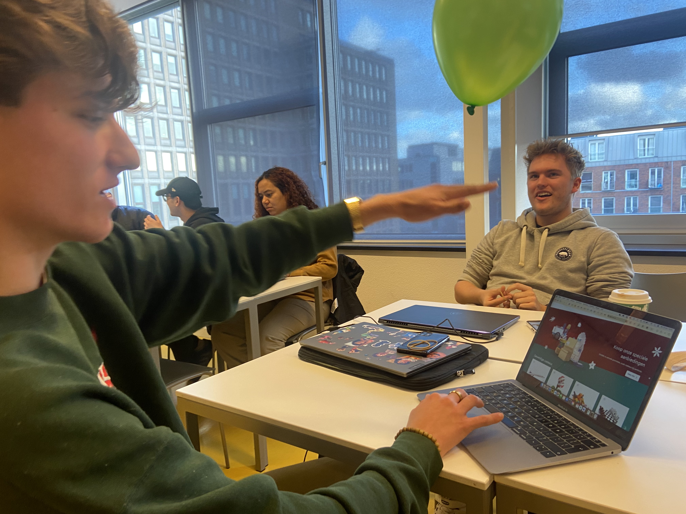
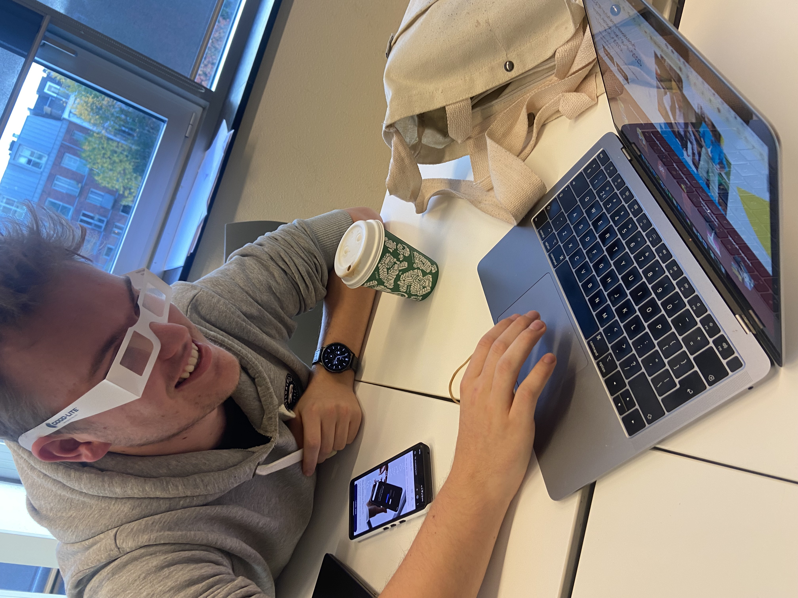
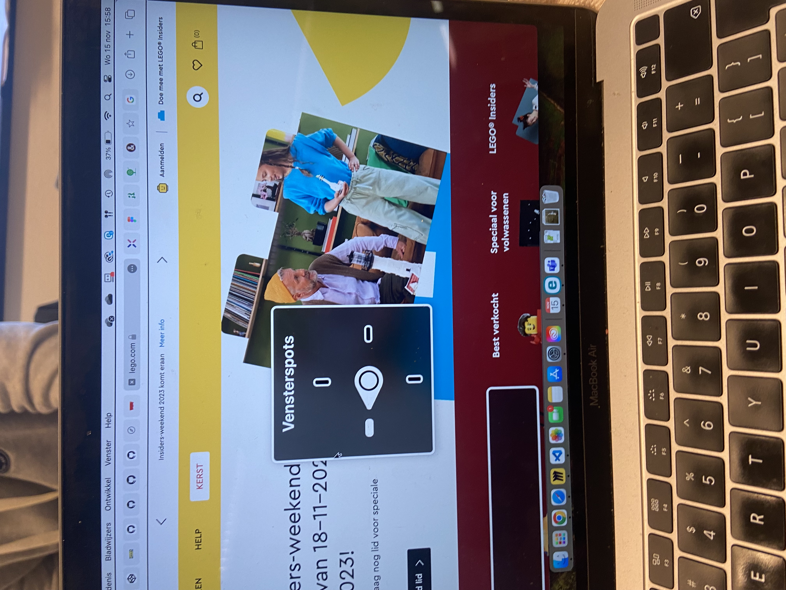

# Procesverslag
Markdown is een simpele manier om HTML te schrijven.  
Markdown cheat cheet: [Hulp bij het schrijven van Markdown](https://github.com/adam-p/markdown-here/wiki/Markdown-Cheatsheet).

Nb. De standaardstructuur en de spartaanse opmaak van de README.md zijn helemaal prima. Het gaat om de inhoud van je procesverslag. Besteedt de tijd voor pracht en praal aan je website.

Nb. Door *open* toe te voegen aan een *details* element kun je deze standaard open zetten. Fijn om dat steeds voor de relevante stuk(ken) te doen.

## Jij

  
uitwerken voor kick-off werkgroep

  ### Auteur:
Eline Slikkerveer

  #### Je startniveau:
Blauw

  #### Je focus:
Responsive 
 

## Je website

  
uitwerken voor kick-off werkgroep

  ### Je opdracht:
Amsterdam.nl

  #### Screenshot(s) van de eerste pagina (small screen): 
Home pagina
  

  #### Screenshot(s) van de tweede pagina (small screen):
Nieuws pagina
  
 

## Toegankelijkheidstest 1/2 (week 1)

  
uitwerken na test in 2e werkgroep

  ### Bevindingen
Lego
Ballon test
- Moeilijk twee dingen tegelijk doen.
- Minder informatie
- Grotere knoppen met minder stappen tot je doel

Wazig bril test
- Contrast
- Dingen op de plek dat je ze verwacht
- Zoekbalk Groter
- Muis kwijt

Screen Reader test Home screen
Hij slaat terwijl je door de homepagina heen tabt een heel stuk over. 
Ook mist hij veel linkjes/ nav die naar andere delen van de website verwijst.

Gemeente Amsterdam
De website van de gemeente amsterdam is al erg toegankelijk. 
Verbeterpuntjes zijn bvb een gekke volgorde in koppen en soms zegt hij H1 gemeente Amsterdam terwijl dat geen zichtbare kop is op de pagina. 

## Breakdownschets (week 1)

  
uitwerken na afloop 3e werkgroep

  ### de hele pagina: 
  

## Voortgang 1 (week 2)

  
uitwerken voor 1e voortgang

  ### Stand van zaken
Ik ben volop bezig met het oefenen met css, maar merk wel dat het moeilijker is  dan in eerste instantie gedacht. Ik merk dat ik vooral in de knoop zit met het namaken van mijn gekozen website. Ik heb gekozen voor de Lego site maar die heeft enorm veel gekke dingen en moeilijke onderdelen, waardoor ik het lastig vind om te beginnen. 

Ik heb nu alles in HTML staan, maar merk dat ik het lastig vind om de geleerde stof uit de oefeningen toe te passen op mijn eigen onderdelen en karakters. Tijdens het oefenen denk ik dan heel goed te snappen wat precies de bedoeling is, maar wanneer ik het dan wil toepassen loop ik toch vast. 

Ik twijfel daarom aan de lego website. Het lijkt me misschien handiger om een overzichtelijker site te kiezen, zodat ik niet te overwhelm wordt van alle gekke onderdelen. 

  ### Agenda voor meeting

Mijn Agenda punten
- In hoeverre moet mijn site echt lijken op de site die ik gekozen heb? Mag ik het ook zien als een soort van richtlijn / style pagina?
- Is het oké als ik van site wissel? Ik weet dat het veel extra werk is maar ik denk dat ik dan meer overzicht heb en een beter plan kan maken nu ik al een idee heb qua mogelijkheden

  ### Verslag van meeting
  hier na afloop snel de uitkomsten van de meeting vastleggen

  - Het helpt om Heen en weer te springen van vorige codeer vakken
  - Ik mag nog een andere website kiezen

## Voortgang 2 (week 3)

  
uitwerken voor 2e voortgang

  ### Stand van zaken
Omdat ik deze week opniew ben begonnen had ik een hoop in te halen. Ik heb snel de schetsen gemaakt en alles in Html gezet. Dit verliep verbazing wekkend soepel, maar dat zal vast komen door dat ik het nu  voor de tweede keer doe. 

  

  

Ik ben begonnen met het vorm geven van de nav. Hierbij ben ik begonnen met de basic lay out zoals we in de les geleled hebben. Waarbij als het  scherm te smal wordt er een uitklap menu ontstaat. Hierbij heb ik nog niet al te veel gelet op de vormgeving. Het gaat me erom dat hij werkt. 

  
  

Ook heb ik de atrikelen met linkjes in een grid gezet en een rode hover en een dropshadow toe gevoed. Uit de opdrachten van week 1. 

Aan de nieuws site heb ik nog niet veel aangepast. Wel heb ik de linkjes een donker rode kleur gegeven zodat ze lekker op vallen. 

  ### Agenda voor meeting
  Mijn Agenda punten
  - Wat zijn exact de eisen van resonsive? Mijn site is momenteel namelijk helemaal responsive maar ook nog super saai. 
  - Het lijkt me leuk om gwn andere gridjes en stickey afbeeldingen toe te voegen maar mag dat, aangezien het niet op de echte website staat. 
  - Hoe kan ik de section achter het nieuws kopje dat voor de achtergrond img staat  een kleur geven, zonder meteen het hele vak te  kleuren. 

  ### Verslag van meeting
  hier na afloop snel de uitkomsten van de meeting vastleggen

  - Het is goed dat je site responsive is, maar op de nieuws site moet nog wel iets extra's
  - Je mag een div gebruiken, omdat het alleen voor de vormggeving is

## Toegankelijkheidstest 2/2 (week 4)

  
uitwerken na test in 9e werkgroep

  ### Bevindingen
Op mijn home scherm is een soort van keuze menu nav wat allemaal linkjes zijn naar verschillende delen van de website. Alleen ziet hij het niet als een linkje.
mijn tab doet t alleen in de footer. 

pepijn
- linkjes duidelijkere linkjes maken
- focus state maken
- text alternative voor de nieuws img
- skip link 
- dark and light + High contrast mode
- increase  text  size 200%

## Voortgang 3 (week 4)

  
uitwerken voor 3e voortgang

  ### Stand van zaken
 Ik ben begonnen met het vormgeven van de footer. In de footer wil ik graag en form verwerken. Dus heb ik die als in de opdrachten toegevoegd. In het begin had ik de imput verkeerd gedaan maar na dat ik dat had veranderd naar email werkte hij helemaal.  

  

  

 Daarna heb ik de buttons op mijn site opnieuw voorm gegeven aan de hand van de opdrachten uit week 3. Het een hover en een active state, zodat het voor iedereen duidelijk is dat het een knop is en hij lekker op valt. 
  
  
  
  

 De button in de footer toevoegen ging opzich wel makkelijk, omdat ik verder nog niks met de vormgeving had gedaan. In de nav was dit helaas niet het geval. Maar uiteindelijk lukte het wel en besloot ik ook derest van de nav aan te passen. Ik vond de full screen uitklap menu een beetje overbodig en het leek me leuk om te kijken of ik hem kon omzetten naar een drop down. Dit lukte helaas niet. Ik kreeg het niet voor elkaar om de slider van boven te laten komen ipv van rechts. Dus heb ik na veel googlen en proberen het maar zo gelaten.

 Nu heb ik dus een kleine slider die van rechts komt. Ook heb ik hier in de hover en active state vormgegeven.  

  
  
  

Daarnaast heb ik ook op de nieuws pagina een andere soort grid gemaakt voor op de breede versie van het scherm. Ik wou aan de rechter kant de img stickey maken alleen lukte het niet helemaal. hij bleef eerst niet plakken, wat bleek ik was de top vergeten en nadat ik die had toegevoegd bleef de img idd plakken. Daarna nog even een z-index toegevoegd en nu staat die helemmaal goed op zijn plekje. Met een media queri heb ik ervoor gezordt dat hij pas na 47em weer terug onder elkaar springt. Anders wordt het allemaal te smal en is het haast niet leesbaar. 

  
  
  

  ### Agenda voor meeting
  samen met je groepje opstellen

  | student 1      | student 2          | student 3    | student 4        |
  | ---            | ---                | ---          | ---              |
  | dit bespreken  | en dit             | en ik dit    | en dan ik dat    |
  | en dat ook nog | dit als er tijd is | nog een punt | dit wil ik zeker |
  | ...            | ...                | ...          | ...              |

  ### Verslag van meeting
  hier na afloop snel de uitkomsten van de meeting vastleggen

  - punt 1
  - punt 2
  - nog een punt
  - ...

  ### Stand van zaken na de meeting
  

## Eindgesprek (week 5)

  
uitwerken voor eindgesprek

  ### Je uitkomst - karakteristiek screenshots:
  

  ### Dit ging goed/Heb ik geleerd: 
  Korte omschrijving met plaatjes

  

  ### Dit was lastig/Is niet gelukt:
  Korte omschrijving met plaatjes

  

## Bronnenlijst

  
continu bijhouden terwijl je werkt

  Nb. Wees specifiek ('css-tricks' als bron is bijv. niet specifiek genoeg). 
  Nb. ChatGpT en andere AI horen er ook bij.
  Nb. Vermeld de bronnen ook in je code.

  1. bron 1
  2. bron 2
  3. ...

