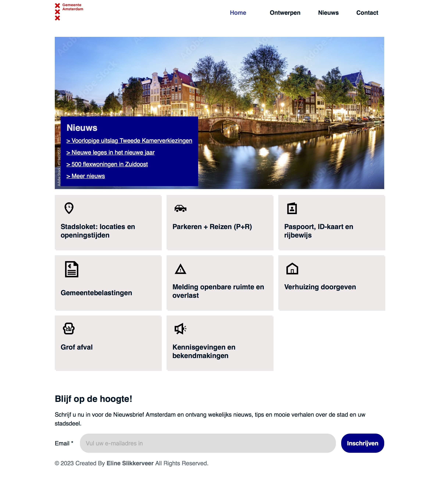
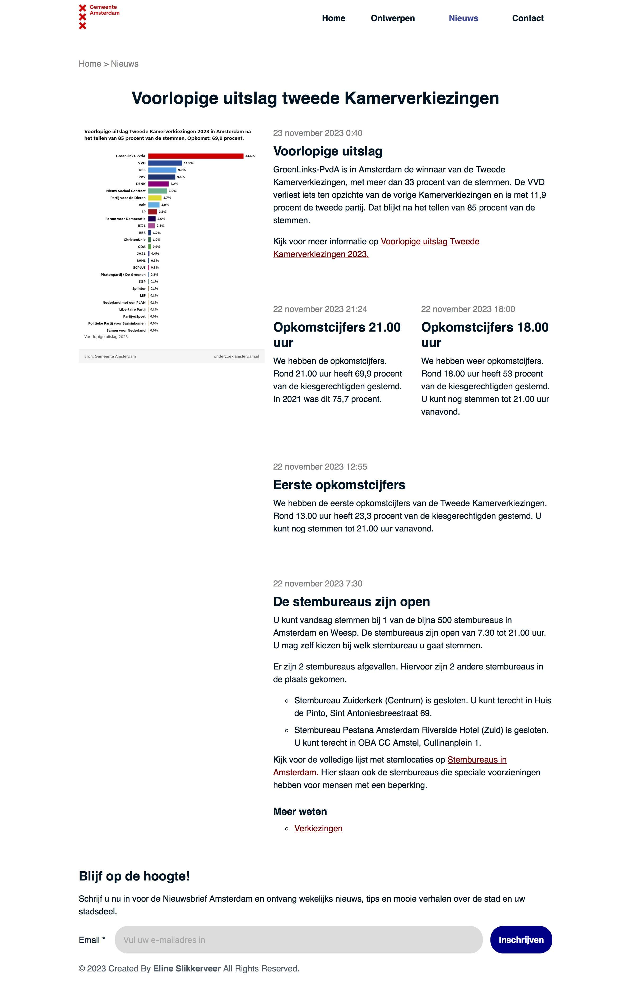
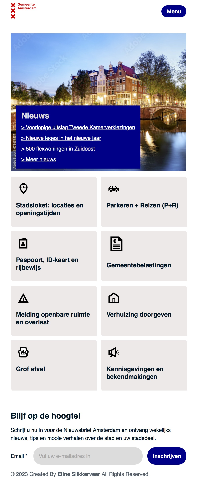
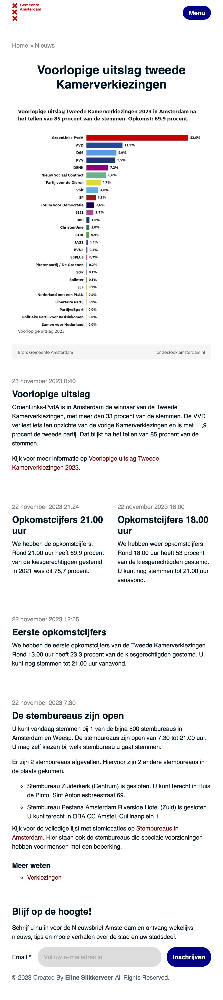

# Procesverslag

## Jij

  
uitwerken voor kick-off werkgroep

  ### Auteur:
Eline Slikkerveer

  #### Je startniveau:
Blauw

  #### Je focus:
Responsive 
 

## Je website

  
uitwerken voor kick-off werkgroep

  ### Je opdracht:
Amsterdam.nl

  #### Screenshot(s) van de eerste pagina (small screen): 
Home pagina
  

  #### Screenshot(s) van de tweede pagina (small screen):
Nieuws pagina
  
 

## Toegankelijkheidstest 1/2 (week 1)

  
uitwerken na test in 2e werkgroep

  ### Bevindingen
Lego
Ballon test
- Moeilijk twee dingen tegelijk doen.
- Minder informatie
- Grotere knoppen met minder stappen tot je doel

Wazig bril test
- Contrast
- Dingen op de plek dat je ze verwacht
- Zoekbalk Groter
- Muis kwijt

Screen Reader test Home screen
Hij slaat terwijl je door de homepagina heen tabt een heel stuk over. 
Ook mist hij veel linkjes/ nav die naar andere delen van de website verwijst.

Gemeente Amsterdam
De website van de gemeente amsterdam is al erg toegankelijk. 
Verbeterpuntjes zijn bvb een gekke volgorde in koppen en soms zegt hij H1 gemeente Amsterdam terwijl dat geen zichtbare kop is op de pagina. 

## Breakdownschets (week 1)

  
uitwerken na afloop 3e werkgroep

  ### de hele pagina: 
  

## Voortgang 1 (week 2)

  
uitwerken voor 1e voortgang

  ### Stand van zaken
Ik ben volop bezig met het oefenen met css, maar merk wel dat het moeilijker is  dan in eerste instantie gedacht. Ik merk dat ik vooral in de knoop zit met het namaken van mijn gekozen website. Ik heb gekozen voor de Lego site maar die heeft enorm veel gekke dingen en moeilijke onderdelen, waardoor ik het lastig vind om te beginnen. 

Ik heb nu alles in HTML staan, maar merk dat ik het lastig vind om de geleerde stof uit de oefeningen toe te passen op mijn eigen onderdelen en karakters. Tijdens het oefenen denk ik dan heel goed te snappen wat precies de bedoeling is, maar wanneer ik het dan wil toepassen loop ik toch vast. 

Ik twijfel daarom aan de lego website. Het lijkt me misschien handiger om een overzichtelijker site te kiezen, zodat ik niet te overwhelm wordt van alle gekke onderdelen. 

  ### Agenda voor meeting

Mijn Agenda punten
- In hoeverre moet mijn site echt lijken op de site die ik gekozen heb? Mag ik het ook zien als een soort van richtlijn / style pagina?
- Is het oké als ik van site wissel? Ik weet dat het veel extra werk is maar ik denk dat ik dan meer overzicht heb en een beter plan kan maken nu ik al een idee heb qua mogelijkheden

  ### Verslag van meeting
  hier na afloop snel de uitkomsten van de meeting vastleggen

  - Het helpt om Heen en weer te springen van vorige codeer vakken
  - Ik mag nog een andere website kiezen

## Voortgang 2 (week 3)

  
uitwerken voor 2e voortgang

  ### Stand van zaken
Omdat ik deze week opniew ben begonnen had ik een hoop in te halen. Ik heb snel de schetsen gemaakt en alles in Html gezet. Dit verliep verbazing wekkend soepel, maar dat zal vast komen door dat ik het nu  voor de tweede keer doe. 

  

  

Ik ben begonnen met het vorm geven van de nav. Hierbij ben ik begonnen met de basic lay out zoals we in de les geleled hebben. Waarbij als het  scherm te smal wordt er een uitklap menu ontstaat. Hierbij heb ik nog niet al te veel gelet op de vormgeving. Het gaat me erom dat hij werkt. 

  
  

Ook heb ik de atrikelen met linkjes in een grid gezet en een rode hover en een dropshadow toe gevoed. Uit de opdrachten van week 1. 

Aan de nieuws site heb ik nog niet veel aangepast. Wel heb ik de linkjes een donker rode kleur gegeven zodat ze lekker op vallen. 

  ### Agenda voor meeting
  Mijn Agenda punten
  - Wat zijn exact de eisen van resonsive? Mijn site is momenteel namelijk helemaal responsive maar ook nog super saai. 
  - Het lijkt me leuk om gwn andere gridjes en stickey afbeeldingen toe te voegen maar mag dat, aangezien het niet op de echte website staat. 
  - Hoe kan ik de section achter het nieuws kopje dat voor de achtergrond img staat  een kleur geven, zonder meteen het hele vak te  kleuren. 

  ### Verslag van meeting
  hier na afloop snel de uitkomsten van de meeting vastleggen

  - Het is goed dat je site responsive is, maar op de nieuws site moet nog wel iets extra's
  - Je mag een div gebruiken, omdat het alleen voor de vormggeving is

## Toegankelijkheidstest 2/2 (week 4)

  
uitwerken na test in 9e werkgroep

  ### Bevindingen
Op mijn home scherm is een soort van keuze menu nav wat allemaal linkjes zijn naar verschillende delen van de website. Alleen ziet hij het niet als een linkje.
mijn tab doet t alleen in de footer. 

pepijn
- linkjes duidelijkere linkjes maken
- focus state maken
- text alternative voor de nieuws img
- skip link 
- dark and light + High contrast mode
- increase  text  size 200%

## Voortgang 3 (week 4)

  
uitwerken voor 3e voortgang

  ### Stand van zaken
 Ik ben begonnen met het vormgeven van de footer. In de footer wil ik graag en form verwerken. Dus heb ik die als in de opdrachten toegevoegd. In het begin had ik de imput verkeerd gedaan maar na dat ik dat had veranderd naar email werkte hij helemaal.  

  

  

 Daarna heb ik de buttons op mijn site opnieuw voorm gegeven aan de hand van de opdrachten uit week 3. Het een hover en een active state, zodat het voor iedereen duidelijk is dat het een knop is en hij lekker op valt. 
  
  
  
  

 De button in de footer toevoegen ging opzich wel makkelijk, omdat ik verder nog niks met de vormgeving had gedaan. In de nav was dit helaas niet het geval. Maar uiteindelijk lukte het wel en besloot ik ook derest van de nav aan te passen. Ik vond de full screen uitklap menu een beetje overbodig en het leek me leuk om te kijken of ik hem kon omzetten naar een drop down. Dit lukte helaas niet. Ik kreeg het niet voor elkaar om de slider van boven te laten komen ipv van rechts. Dus heb ik na veel googlen en proberen het maar zo gelaten.

 Nu heb ik dus een kleine slider die van rechts komt. Ook heb ik hier in de hover en active state vormgegeven.  

  
  
  

Daarnaast heb ik ook op de nieuws pagina een andere soort grid gemaakt voor op de breede versie van het scherm. Ik wou aan de rechter kant de img stickey maken alleen lukte het niet helemaal. hij bleef eerst niet plakken, wat bleek ik was de top vergeten en nadat ik die had toegevoegd bleef de img idd plakken. Daarna nog even een z-index toegevoegd en nu staat die helemmaal goed op zijn plekje. Met een media queri heb ik ervoor gezordt dat hij pas na 47em weer terug onder elkaar springt. Anders wordt het allemaal te smal en is het haast niet leesbaar. 

  
  
  

  ### Agenda voor meeting
  Mijn Agenda punten
  - Hoe zorg ik ervoor dat de button naar rechts gaat als het scherm kleiner wordt. 
  - Waarom wekt mijn tab niet behalve in bij de button in de footer. 

  ### Verslag van meeting
  hier na afloop snel de uitkomsten van de meeting vastleggen
  - margin-left
  - Een instelling

  ### Stand van zaken na de meeting
Ik ben begonnen met het beter vormgeven van de tab. Dit heb ik gedaan door de focus aan te roepen en daar een kleur en een border radius toe te voegen. Na wat spelen met de padding dacht ik dat het goed zou zijn, alleen toen ik het uitprobeerde werkte het toch niet helemaal zoals in gedachte. Hij pakte namelijk ook de afzondelijke linkjes in de index main. Hierdoor kwam er een geke lijn om de text. Dit heb ik opgelost met de focus-within. Ook had ik de kleur donker blauw gemaakt, alleen zitten er ook linkjes in de eerste artikel die een donkerblauwe achtergrond heeft. Hierdoor is onzichtbaar, daarom heb ik die rood gemaakt. 

  

   

Ook heb ik een uitgebreide alternative text toegevoegd. Het is namelijk een grafiek met veel informatie die nergens anders staat. Dit heb ik dus allemaal toegevoegd in de alt. 

- alt="Voorlopige uitslagen tweede Kamerverkiezingen 2023 in Amsterdam na het tellen van 85 procent van de stemmen. Opkomst 69,9 procent. GroenLinks-PvdA 33,6%. VVD 11,9%. D66 9,9%. PVV 9,5%. DENK 7,2%. Nieuw Sociaal Contract 6,6%. Partij voor de Dieren 4,7%. Volt 4,0%. SP 3,1%. Form voor Democratie 2,9%. BIJ1 2,3%. BBB 1,0%. ChristenUnie 1,0%. CDA 0,9%. JA21 0,4%. BVNL 0,3%. 50PLUS 0,3% Piratenpartij / De Groenen 0,2%. SGP 0,1%. Splinter 0,1%. LEF 0,1%. Nederland met een Plan 0,1%, Libertaire Partij 0,1%. PartijvdSport 0,0%. Politieke Partij voor Basisinkomen 0,0%, Samen voor Nederland 0,0%"

Ook heb ik de light en dark mode verbeterd en aangepast in de root. Ik had hier eerder iets beter over moeten nadenken want ik had nogsteeds heel veel kleuren niet in mijn root gezet. Hierdoor moest ik nu alles nog toevoegen wat ik de volgende keer meteen ga doen. 

Helaas is de skip link niet gelukt. Ik heb veel gegoogeld en geprobeerd, maar ik kwam er niet uit. Waneer ik iets probeerde verdwenen al mijn linkjes en werden ze onzichtbaar. 

## Eindgesprek (week 5)

  
uitwerken voor eindgesprek

  ### Je uitkomst - karakteristiek screenshots:
  
  
  
  

  ### Reflectie: 
Oh ik heb een hele hoop geleerd. Het begon natuurlijk met het vormgeven van tekst. Ik had nooit op deze manier naar css gekeken. Ik moet nu voor het vak vormgeving een animatie maken en besef me nu pas hoe vet het was geweest als ik dat in css had gedaan. Wil me daar zekker nog verder in verdiepen. 

Van grid en flex box heb ik ook veel gebruik gemaakt. Ik wordt er steeds beter in maar vind het nogsteeds lastig. Soms heb ik het idee dat het gwn onvoorspelbare dingen doet en dan krijg ik het niet opgelost. Zo leek het me leuk als je op de nieuws site nog een fun gridje te hebben. Met twee kollomen en dan het eerste en laatste stukje text span 2 en de middelste naast elkaar. Alleen stonden er twee dives op het stuk waardoor het helemaal mis ging en het me niet lukte. Na dat ik van alles geprobeerd had aan te passen heb ik het voor nu maar even op gegeven. OMG het is me net gelukt!!!!!!!!! Super blij! ik denk dat ik gister avond iets te moe was want ik heb volgensmij dezelfde stappen weer genomen en nu is het wel gelukt!!!

 

Java Script snap ik eindelijk na al een goed blok inleiding programeren. Dus daar ben ik erg blij mee.

De oefeningen over de Animaties vond ik echt super gaaf. Om te zeggen dat ik er echt super goed in ben, nee. Maar ik snap de opdrachten wel. Ik vind het alleen soms lasig om het dan toe te passen in mijn eigen site, omdat de site zo netjes is vande gemeente en ik dan niet weet waar ik ze zou moeten toevoegen. 

De states heb ik goed onder de knie. Het is vrij makkelijk omdat je niet je hele site ermee kan omgooien. Wat me een erg fijn gevoel geeft. 

Heb ook veel geleerd over de screenreader. Bij de eerste toegankelijkheids test snapte ik er echt helemaal niks van. Maar nu kan ik er eindelijk mee overweg. Het is sowiso fijn om te gebruiken aangezien ik enorm dyslecties ben en op deze manier ook dingen kan laten voorlezen. 

## Bronnenlijst

  
continu bijhouden terwijl je werkt

  1. https://developer.mozilla.org/en-US/docs/Web/HTML/Element 
  2. https://validator.w3.org/nu/?doc=https%3A%2F%2Felineslik.github.io%2FGemeente-Amsterdam-redesign%2F 
  3. https://stock.adobe.com/nl/search?
  4. https://www.accessibility.nl/kennis/zo-zet-je-skiplinks-voor-een-optimale-navigatie 

